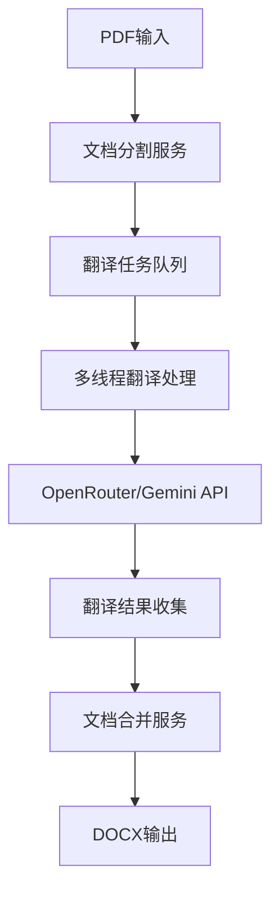

# PDF文档智能翻译系统后端实施计划

## 项目概述

本计划专注于构建PDF文档智能翻译系统的核心后端服务，实现最小可行的翻译流程：文档分割、并行翻译和结果合并。通过OpenRouter/Gemini API实现无需VPN的高质量翻译。

## 系统架构设计

### 1. 核心后端架构

### 2. 核心模块说明

#### 2.1 文档分割服务
- **功能**: 基于现有代码，将PDF智能分割为多个片段
- **技术**: 增强现有的`pdf_splitter.py`和`gemini_client.py`
- **输出**: 结构化的文档片段数组

#### 2.2 翻译任务管理
- **功能**: 管理并行翻译任务的分发和状态跟踪
- **技术**: Node.js + Redis队列
- **输出**: 任务状态和进度信息

#### 2.3 并行翻译引擎
- **功能**: 多线程调用OpenRouter API进行翻译
- **技术**: Worker Threads + OpenRouter服务
- **输出**: 翻译后的文本片段

#### 2.4 文档合并服务
- **功能**: 将翻译片段按原始顺序合并为完整文档
- **技术**: 基于现有的python-docx处理逻辑
- **输出**: 完整的翻译DOCX文档

## 最小化实施步骤

### 第一阶段：核心翻译服务搭建（第1-3天）

#### 1.1 环境配置
- 配置OpenRouter API密钥和模型设置
- 设置Redis队列用于任务管理
- 配置并发参数（最大工作线程数、队列大小等）
- 设置文档分割参数（片段大小、重叠区域等）

#### 1.2 翻译服务核心架构
- **TranslationService类**: 主要服务管理器，负责任务分发和结果收集
- **Worker线程池**: 并行处理翻译任务
- **任务队列**: Redis队列管理待处理和进行中的任务
- **结果管理**: 内存Map存储翻译结果，按段落ID排序

### 第二阶段：文档分割与格式保留（第4-6天）

#### 2.1 基础文档分割
- **使用现有分割器**: 直接使用`tools/experiments/PDF_to_DOCX/src/pdf_splitter.py`
- **简单分割策略**: 按页数或字符数进行基础分割，不做复杂算法优化
- **DocumentSegment数据结构**: 定义包含完整格式信息的文档片段格式

#### 2.2 完整格式保留系统
- **全面格式提取**: 保留所有原始格式（字体、大小、颜色、对齐、间距等）
- **样式映射表**: 建立详细的样式对应关系，确保翻译后格式一致
- **结构化格式存储**: 在片段元数据中存储完整的格式信息
- **格式验证机制**: 确保翻译过程中格式不丢失

### 第三阶段：文档合并与格式重建（第7-9天）

#### 3.1 智能文档合并器
- **DocumentMerger类**: 负责将翻译片段按原始顺序合并
- **格式重建引擎**: 根据保存的格式信息重建完整文档样式
- **顺序保证**: 确保片段按照分割时的ID顺序正确合并
- **元数据恢复**: 完整恢复原文档的所有属性和设置

#### 3.2 完整格式重建
- **样式应用**: 精确应用所有保存的格式信息
- **结构重建**: 恢复标题层级、列表结构、表格格式等
- **版面保持**: 确保段落间距、页边距、页眉页脚等版面元素
- **质量验证**: 验证重建后的文档格式与原文档一致性

### 第四阶段：完整GraphQL API接口（第10-12天）

#### 4.1 完整GraphQL Schema设计
- **翻译任务类型**: TranslationJob（包含详细状态、进度、错误信息、文件元数据）
- **翻译片段类型**: TranslationSegment（包含原文、译文、格式信息、状态）
- **文档类型**: Document（文件信息、类型、大小、上传时间等）
- **用户类型**: User（翻译历史、偏好设置、配额管理）
- **详细状态枚举**: QUEUED, UPLOADING, SPLITTING, TRANSLATING, MERGING, COMPLETED, FAILED, CANCELLED

#### 4.2 完整API操作集
**Mutations:**
- startTranslation（启动翻译）
- cancelTranslation（取消翻译）
- retryTranslation（重试翻译）
- uploadDocument（文档上传）
- deleteTranslation（删除翻译任务）
- updateTranslationSettings（更新翻译设置）

**Queries:**
- getTranslationJob（获取单个翻译任务详情）
- listTranslationJobs（获取翻译任务列表，支持分页和筛选）
- getTranslationHistory（获取翻译历史）
- getTranslationStatistics（获取翻译统计信息）
- checkTranslationStatus（批量查询多个任务状态）

**Subscriptions:**
- translationProgress（实时翻译进度推送）
- translationStatusUpdates（翻译状态变更通知）

#### 4.3 高级任务管理系统
- **TranslationJobManager**: 完整任务生命周期管理
- **队列优先级**: 支持不同优先级的翻译任务
- **并发控制**: 智能的并发任务调度和资源管理
- **错误恢复**: 自动重试和故障恢复机制
- **进度追踪**: 详细的进度信息和时间估算

## 集成阶段（后端完成后进行）

### 前端集成计划
*注：此阶段在核心后端服务完成并测试通过后进行*

#### 基础翻译界面
- **文件上传组件**: PDF/DOCX文件上传
- **语言选择**: 源语言和目标语言选择器
- **进度显示**: 实时显示翻译进度和状态
- **结果下载**: 翻译完成后的文件下载功能

## 核心技术要求

### 必需依赖
- **Node.js 18+**: 支持Worker Threads
- **任务队列系统**: Redis（推荐）或本地队列系统
- **Python 3.8+**: 现有PDF处理代码
- **OpenRouter API**: 无需VPN的Gemini访问

### Redis替代方案（中国网络环境考虑）
**选项1: 本地Redis部署**
- 在服务器本地部署Redis实例
- 适用于单服务器部署环境
- 无网络访问限制

**选项2: 内存队列系统**
- 使用Node.js内置的队列管理
- 适用于小规模部署
- 重启时任务状态会丢失，需要持久化机制

**选项3: 数据库队列**
- 使用PostgreSQL或MySQL作为任务队列
- 利用现有数据库基础设施
- 性能略低于Redis但更稳定

**选项4: 云服务Redis**
- 使用阿里云Redis、腾讯云Redis等
- 适用于云端部署
- 需要考虑网络延迟和成本

### 关键配置
- **并发控制**: 最大10个Worker线程（可配置）
- **文档分割**: 每片段最大2048字符（简单分割，不优化算法）
- **重试机制**: API失败时最多重试3次
- **任务过期**: 任务24小时后自动清理
- **格式保留**: 完整保留所有原始格式信息

## 最小化实施重点

### 核心功能范围
1. **PDF分割**: 使用现有代码进行基础文档分割（不优化算法）
2. **完整格式保留**: 确保所有格式信息在翻译过程中完整保持
3. **并行翻译**: 多线程调用OpenRouter API
4. **精确结果合并**: 按顺序合并翻译片段，完整重建格式
5. **完整API接口**: 全功能GraphQL API，支持所有翻译操作
6. **高级状态管理**: 详细的任务状态跟踪和进度显示

### 重点关注领域
- **格式完整性**: 确保翻译后文档格式与原文档100%一致
- **API完整性**: 提供完整的GraphQL API，不做简化
- **队列系统灵活性**: 支持多种队列系统选择（Redis/本地/数据库）
- **翻译质量**: 通过OpenRouter确保高质量翻译结果

### 不过度优化的功能
- 文档分割算法（使用现有简单策略）
- 性能调优（满足基本需求即可）
- 复杂的负载均衡
- 高级缓存策略

## 测试策略

### 核心测试重点
1. **格式保留测试**: 验证所有格式信息在翻译过程中完整保持
2. **文档重建测试**: 确保合并后的文档格式与原文档完全一致
3. **翻译API测试**: 确保OpenRouter集成正常工作
4. **GraphQL API测试**: 验证所有API操作功能完整
5. **并发处理测试**: 验证多线程翻译不会出现竞态条件
6. **队列系统测试**: 测试不同队列系统的兼容性
7. **端到端测试**: 完整的PDF→分割→翻译→格式重建→DOCX流程测试

## 实施时间线

### 后端开发阶段（共15天）

| 阶段 | 时间 | 核心任务 | 交付物 |
|------|------|---------|--------|
| 第一阶段 | 第1-3天 | 翻译服务核心架构 + 队列系统 | Worker线程池 + 灵活任务管理 |
| 第二阶段 | 第4-6天 | 文档分割 + 完整格式保留 | 基础分割器 + 全面格式提取 |
| 第三阶段 | 第7-9天 | 文档合并 + 格式重建 | 智能合并器 + 完整格式重建 |
| 第四阶段 | 第10-12天 | 完整GraphQL API开发 | 全功能API + 订阅支持 |
| 第五阶段 | 第13-15天 | 格式保留验证 + API完善 | 格式一致性保证 + API优化 |

### 测试与部署阶段（第16-18天）
- 格式保留专项测试
- GraphQL API全面测试
- 队列系统兼容性测试
- 端到端流程验证

## 关键成功因素

### 技术实现重点
1. **现有代码复用**: 最大化利用`tools/experiments/PDF_to_DOCX`中的现有功能（不优化算法）
2. **完整格式保留**: 确保100%格式一致性，这是核心优先级
3. **OpenRouter集成**: 确保API调用稳定可靠，实现无VPN访问
4. **队列系统灵活性**: 支持多种队列方案，适应不同部署环境
5. **完整API设计**: 提供功能完整的GraphQL API
6. **错误处理**: 完善的重试机制和错误恢复策略

### 产品目标
- **核心功能**: PDF分割 → 并行翻译 → 完整格式重建 → DOCX输出
- **格式目标**: 翻译后文档格式与原文档100%一致
- **API目标**: 提供完整功能的GraphQL API，支持所有翻译操作
- **性能目标**: 10页文档处理时间 < 3分钟
- **稳定性**: 单次翻译成功率 > 95%
- **队列兼容**: 支持Redis、本地队列、数据库队列等多种方案

## 下一步行动

### 立即开始
1. **环境准备**: 配置OpenRouter API密钥和选择队列系统方案
2. **代码审查**: 深入理解现有PDF处理代码，重点关注格式提取
3. **架构搭建**: 实现TranslationService核心类和格式保留系统
4. **API测试**: 验证OpenRouter连接和基础翻译功能

### 队列系统决策
根据部署环境选择最适合的队列系统：
- **云端部署**: 优先选择云服务Redis（阿里云、腾讯云等）
- **本地部署**: 使用本地Redis实例或PostgreSQL队列
- **简单部署**: 使用内存队列 + 文件持久化

### 后续计划
1. 完成核心后端服务，重点保证格式完整性
2. 开发完整的GraphQL API
3. 进行格式保留专项测试
4. 队列系统兼容性验证
5. 前端界面集成
