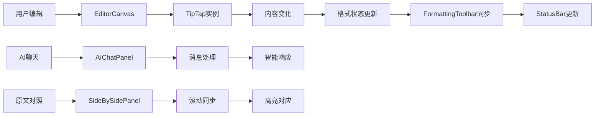
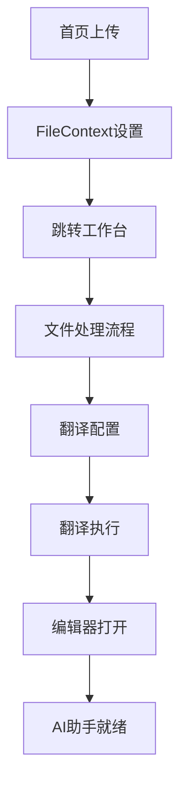

# 格式译专家 - 前端架构文档

## 项目概述

**项目名称**: SeekHub Demo - 格式译专家  
**版本**: 0.1.0  
**描述**: 基于 AI 的智能翻译平台，支持多种文档格式的翻译，保持原文档格式和排版，具备完整的翻译工作流和智能AI助手

## 技术栈

### 核心框架
- **Next.js**: 15.2.4 (React 全栈框架，使用 App Router)
- **React**: ^19 (UI 库)
- **TypeScript**: ^5 (类型安全)

### 样式和UI组件
- **TailwindCSS**: ^3.4.17 (原子化 CSS 框架)
- **Radix UI**: 完整的无障碍性UI组件库
- **Lucide React**: ^0.454.0 (图标库)
- **class-variance-authority**: ^0.7.1 (条件样式)
- **tailwind-merge**: ^2.5.5 (样式合并)
- **tailwindcss-animate**: ^1.0.7 (动画)

### 编辑器和富文本
- **TipTap**: ^3.0.9 (富文本编辑器核心)
  - @tiptap/react - React 集成
  - @tiptap/starter-kit - 基础扩展包
  - @tiptap/extension-* - 高级功能扩展 (颜色、字体、对齐等)

### 表单和数据处理
- **React Hook Form**: ^7.54.1 (表单处理)
- **@hookform/resolvers**: ^3.9.1 (表单验证)
- **Zod**: ^3.24.1 (数据验证)

### 其他功能库
- **next-themes**: ^0.4.4 (主题切换)
- **react-resizable-panels**: ^2.1.7 (可调整大小面板)
- **recharts**: 2.15.0 (图表)
- **sonner**: ^1.7.1 (通知)
- **date-fns**: 4.1.0 (日期处理)
- **mammoth**: ^1.10.0 (Word文档处理)
- **file-saver**: ^2.0.5 (文件下载)

## 项目结构

```
nextjs-app/                      # 前端应用根目录
├── app/                         # Next.js App Router 页面
│   ├── globals.css             # 全局样式
│   ├── layout.tsx              # 根布局组件
│   ├── loading.tsx             # 全局加载组件
│   ├── page.tsx                # 首页 (包含PDF上传系统)
│   ├── dashboard_MainPage/     # 仪表板页面
│   │   ├── page.tsx           # 仪表板主页面
│   │   └── loading.tsx        # 仪表板加载页面
│   ├── login/                  # 登录页面
│   ├── preview/                # 预览页面
│   ├── reader-download/        # 读者下载页面
│   ├── reader-translating/     # 读者翻译中页面
│   ├── reader-workspace/       # 读者工作台
│   ├── translate/              # 翻译页面
│   ├── translate-editor/       # 翻译编辑器
│   │   ├── page.tsx           # 编辑器主页面
│   │   ├── constants.ts       # AI助手常量配置
│   │   ├── types.ts           # TypeScript类型定义
│   │   └── hooks/             # 编辑器专用Hooks
│   │       ├── useAIChat.ts   # AI聊天功能Hook
│   │       └── useTextSelection.ts # 文本选择Hook
│   ├── translating/            # 翻译进行中页面
│   ├── user-type/             # 用户类型选择
│   └── workspace/             # 工作台
│       ├── page.tsx           # 工作台主页面
│       └── loading.tsx        # 工作台加载页面
├── components/                 # React 组件
│   ├── ui/                    # 基础UI组件库 (60+ Radix UI组件)
│   │   ├── button.tsx         # 按钮组件
│   │   ├── card.tsx          # 卡片组件
│   │   ├── dialog.tsx        # 对话框组件
│   │   ├── input.tsx         # 输入框组件
│   │   ├── select.tsx        # 选择器组件
│   │   ├── menubar.tsx       # 菜单栏组件
│   │   ├── popover.tsx       # 弹出层组件
│   │   ├── toggle.tsx        # 切换组件
│   │   ├── slider.tsx        # 滑块组件
│   │   ├── progress.tsx      # 进度条组件
│   │   ├── tabs.tsx          # 标签页组件
│   │   ├── scroll-area.tsx   # 滚动区域组件
│   │   └── ... (更多组件)
│   ├── translate-editor/      # 翻译编辑器组件系统
│   │   ├── EditorCanvas.tsx   # TipTap编辑器核心
│   │   ├── FormattingToolbar.tsx # 格式化工具栏
│   │   ├── MainToolbar.tsx    # 主工具栏
│   │   ├── Header.tsx         # 编辑器头部
│   │   ├── StatusBar.tsx      # 状态栏
│   │   ├── AIChatPanel.tsx    # AI聊天面板
│   │   ├── AITutorial.tsx     # AI使用教程
│   │   ├── SideBySideReviewPanel.tsx # 对照面板
│   │   ├── EditorSection.tsx  # 编辑区域组件
│   │   ├── ColorPicker.tsx    # 颜色选择器
│   │   ├── LineHeightPicker.tsx # 行高选择器
│   │   ├── ViewSettingsDialog.tsx # 视图设置对话框
│   │   ├── ExportDialog.tsx   # 导出对话框
│   │   ├── FindReplaceDialog.tsx # 查找替换对话框
│   │   ├── InsertImageDialog.tsx # 插入图片对话框
│   │   ├── InsertTableDialog.tsx # 插入表格对话框
│   │   ├── InsertLinkDialog.tsx # 插入链接对话框
│   │   └── InsertSymbolDialog.tsx # 插入符号对话框
│   └── theme-provider.tsx     # 主题提供者
├── context/                   # React Context
│   └── file-context.tsx      # 全局文件状态管理
├── hooks/                     # 自定义 Hooks
├── lib/                       # 工具函数
│   └── utils.ts              # 通用工具函数
├── public/                    # 静态资源
├── services/                  # 服务层
│   └── documentService.ts    # 文档处理服务
└── styles/                    # 样式文件
```

## 页面架构

### 1. 首页 (`/`)
- **功能**: 平台介绍、功能展示、PDF上传系统
- **核心特性**:
  - 产品介绍和特色展示
  - 支持的文件格式展示 (PDF、DOCX、EPUB、TXT、MOBI、AZW)
  - 应用场景说明 (学术研究、商业报告、法律合同)
  - PDF上传系统 (拖拽上传、进度显示、自动跳转)
  - FAQ常见问题解答
  - 定价信息展示

### 2. 用户类型选择 (`/user-type`)
- **功能**: 区分专业译者和普通读者
- **路由跳转**:
  - 专业译者 → `/workspace`
  - 普通读者 → `/reader-workspace`

### 3. 仪表板 (`/dashboard_MainPage`)
- **功能**: 用户数据中心和统计概览
- **核心特性**:
  - 用户统计数据 (翻译字符数、完成任务、节省时间、质量评分)
  - 使用情况展示和额度管理
  - 最近活动和任务历史
  - 快速操作入口 (新建翻译、查看历史、团队协作、API集成)
  - 帮助和支持功能

### 4. 工作台 (`/workspace`)
- **功能**: 专业译者的核心工作界面
- **核心特性**:
  - 三栏布局 (项目列表、中央工作区、用户面板)
  - 完整翻译流程管理 (上传→读取→配置→翻译→完成)
  - 翻译配置 (源语言、目标语言、翻译风格、专业领域)
  - 进度追踪和状态管理
  - 文件历史和任务管理
  - 用户配额和统计信息

### 5. 翻译页面 (`/translate`)
- **功能**: 文档上传、翻译配置、开始翻译

### 6. 翻译进行中 (`/translating`)
- **功能**: 实时显示翻译进度、状态更新

### 7. 翻译编辑器 (`/translate-editor`) ⭐ **核心功能**
- **功能**: 专业级翻译编辑和AI助手系统
- **核心组件系统**:
  - **EditorCanvas**: TipTap富文本编辑器核心
  - **MainToolbar**: 主工具栏 (文件、编辑、视图、插入操作)
  - **FormattingToolbar**: 格式化工具栏 (字体、颜色、对齐、列表)
  - **Header**: 文档头部 (标题、保存状态、协作者)
  - **StatusBar**: 状态栏 (页码、字数、语言、缩放)
  - **AIChatPanel**: AI助手聊天面板
  - **SideBySideReviewPanel**: 原文对照面板
- **AI助手功能**:
  - 智能文本选择和@引用系统
  - 多版本译文生成
  - 专业词汇检查和验证
  - 用词建议和斟酌
  - 语法拼写检查
  - 翻译质量自检
  - 个性化指令和自定义操作
- **编辑功能**:
  - 完整的富文本编辑 (加粗、斜体、下划线、删除线)
  - 颜色管理 (文字颜色、背景高亮)
  - 字体和字号控制
  - 行高和对齐设置
  - 列表和缩进功能
  - 插入功能 (图片、表格、链接、符号)
  - 查找替换功能
  - 导出功能 (多种格式)

### 8. 预览页面 (`/preview`)
- **功能**: 翻译结果预览、质量检查
- **模式**: 
  - 专业译者模式：对照预览、编辑功能
  - 普通读者模式：简单下载

### 9. 读者相关页面
- `/reader-workspace`: 读者工作台
- `/reader-translating`: 读者翻译进度
- `/reader-download`: 读者下载页面

### 10. 登录页面 (`/login`)
- **功能**: 用户认证和登录

## 核心组件架构

### 1. 全局状态管理

#### FileProvider 文件上下文
- **文件**: `context/file-context.tsx`
- **功能**: 全局文件状态管理
- **特性**:
  - 跨页面文件状态共享
  - 支持 File 对象管理
  - 提供 useFile Hook

### 2. 翻译编辑器组件系统 ⭐

#### EditorCanvas (核心编辑器)
- **文件**: `components/translate-editor/EditorCanvas.tsx`
- **功能**: 基于 TipTap 的富文本编辑器核心
- **特性**:
  - TipTap编辑器实例管理
  - 格式状态实时同步
  - SSR兼容性 (`immediatelyRender: false`)
  - 自动保存触发
  - 内容变化回调
  - 选择状态更新

#### MainToolbar (主工具栏)
- **文件**: `components/translate-editor/MainToolbar.tsx`  
- **功能**: 菜单式主工具栏系统
- **菜单结构**:
  - **文件**: 新建、打开、保存、另存为、导入、导出、打印
  - **编辑**: 撤销、重做、查找替换、剪切、复制、粘贴
  - **视图**: 缩放、原文对照、标尺、视图设置
  - **插入**: 图片、表格、链接、特殊符号
  - **格式**: 字体、字号、格式化选项
  - **AI助手**: 历史对话、新对话

#### FormattingToolbar (格式化工具栏)
- **文件**: `components/translate-editor/FormattingToolbar.tsx`
- **功能**: 实时格式化控制 ✅ **已完全实现**
- **功能特性**:
  - 文本样式：加粗、斜体、下划线、删除线
  - 颜色系统：文字颜色、背景高亮 (含颜色选择器)
  - 字体控制：字体族、字号选择
  - 对齐方式：左对齐、居中、右对齐、两端对齐
  - 列表功能：项目符号、编号列表、缩进控制
  - 行高控制：7档行高选择器 (1.0-3.0)
  - 键盘快捷键：Ctrl+B/I/U 等标准快捷键
  - 状态同步：编辑器状态与工具栏实时同步

#### Header (文档头部)
- **文件**: `components/translate-editor/Header.tsx`
- **功能**: 文档信息和操作栏
- **特性**:
  - 可编辑文档标题
  - 保存状态指示器 (saved/saving/unsaved)
  - 协作者头像展示
  - 分享和导出按钮

#### StatusBar (状态栏)
- **文件**: `components/translate-editor/StatusBar.tsx`
- **功能**: 底部信息展示和控制
- **信息展示**:
  - 页码导航 (当前页/总页数)
  - 字数统计 (字符数、单词数)
  - 当前语言显示
  - 保存状态
- **视图控制**:
  - 视图模式切换 (编辑/阅读/预览)
  - 缩放级别控制 (滑块+按钮)
  - 原文对照开关

#### AIChatPanel (AI助手面板) ⭐ **核心功能**
- **文件**: `components/translate-editor/AIChatPanel.tsx`
- **功能**: 智能AI翻译助手系统
- **核心特性**:
  - 聊天界面和消息管理
  - @引用系统 (文本选择后自动加入)
  - 文本-操作组合管理
  - 功能分类展示 (翻译优化、词汇检查、质量评估等)
  - 个性化指令支持
  - 智能响应生成

#### SideBySideReviewPanel (对照面板)
- **文件**: `components/translate-editor/SideBySideReviewPanel.tsx`
- **功能**: 原文译文对照系统
- **特性**:
  - 原文/译文分栏显示
  - 句子级别高亮对应
  - 滚动位置同步
  - 可固定/取消固定

#### EditorSection (编辑区域组合)
- **文件**: `components/translate-editor/EditorSection.tsx`
- **功能**: 编辑器区域布局管理
- **特性**:
  - 编辑器和对照面板布局
  - 响应式布局调整
  - 视图状态管理

### 3. 工具组件系统

#### ColorPicker (颜色选择器)
- **文件**: `components/translate-editor/ColorPicker.tsx`
- **功能**: 高级颜色选择系统
- **特性**:
  - 预设颜色板
  - 自定义颜色选择
  - 最近使用颜色记录
  - HSL/RGB色彩模式

#### LineHeightPicker (行高选择器)
- **文件**: `components/translate-editor/LineHeightPicker.tsx`
- **功能**: 行高控制组件
- **特性**:
  - 7档预设行高 (1.0, 1.15, 1.3, 1.5, 2.0, 2.5, 3.0)
  - 可视化选择界面
  - 实时预览效果

### 4. 对话框组件系统

#### ViewSettingsDialog (视图设置)
- **文件**: `components/translate-editor/ViewSettingsDialog.tsx`
- **功能**: 编辑器视图自定义设置
- **设置选项**:
  - 缩放级别、字体设置
  - 主题切换、行号显示
  - 侧边栏位置和宽度
  - 编辑器最大宽度

#### ExportDialog (导出对话框)
- **文件**: `components/translate-editor/ExportDialog.tsx`
- **功能**: 多格式文档导出
- **支持格式**: Word、PDF、HTML、纯文本等

#### FindReplaceDialog (查找替换)
- **文件**: `components/translate-editor/FindReplaceDialog.tsx`
- **功能**: 文本查找和替换
- **特性**: 正则表达式支持、批量替换

#### 插入功能对话框
- **InsertImageDialog**: 图片插入 (本地文件/URL)
- **InsertTableDialog**: 表格插入 (行列设置、表头选项)
- **InsertLinkDialog**: 链接插入 (URL/文本设置)
- **InsertSymbolDialog**: 特殊符号插入

#### AITutorial (AI使用教程)
- **文件**: `components/translate-editor/AITutorial.tsx`
- **功能**: AI助手使用指南
- **特性**: 分步教程、功能演示

### 5. UI组件系统 📦

基于 **Radix UI** 构建的完整组件库，包含 **60+ 组件**：

#### 基础组件
- **button.tsx**: 按钮组件 (多种变体和尺寸)
- **input.tsx**: 输入框组件
- **textarea.tsx**: 多行文本输入
- **label.tsx**: 表单标签
- **card.tsx**: 卡片容器组件
- **badge.tsx**: 徽章组件
- **avatar.tsx**: 头像组件
- **separator.tsx**: 分隔线组件

#### 表单组件
- **select.tsx**: 下拉选择器
- **checkbox.tsx**: 复选框
- **switch.tsx**: 开关组件
- **toggle.tsx**: 切换按钮
- **toggle-group.tsx**: 切换按钮组
- **radio-group.tsx**: 单选按钮组
- **form.tsx**: 表单组件
- **slider.tsx**: 滑块组件

#### 布局组件
- **sheet.tsx**: 侧边面板
- **dialog.tsx**: 对话框
- **popover.tsx**: 弹出层
- **tooltip.tsx**: 工具提示
- **accordion.tsx**: 折叠面板
- **collapsible.tsx**: 可折叠组件
- **tabs.tsx**: 标签页
- **sidebar.tsx**: 侧边栏
- **menubar.tsx**: 菜单栏
- **navigation-menu.tsx**: 导航菜单
- **breadcrumb.tsx**: 面包屑导航

#### 数据展示
- **table.tsx**: 表格组件
- **chart.tsx**: 图表组件
- **progress.tsx**: 进度条
- **calendar.tsx**: 日历组件
- **carousel.tsx**: 轮播图
- **pagination.tsx**: 分页组件

#### 反馈组件
- **alert.tsx**: 警告提示
- **alert-dialog.tsx**: 警告对话框
- **toast.tsx**: 消息提示
- **toaster.tsx**: 消息提示容器
- **sonner.tsx**: 高级消息提示
- **skeleton.tsx**: 骨架屏
- **command.tsx**: 命令面板
- **context-menu.tsx**: 右键菜单
- **dropdown-menu.tsx**: 下拉菜单
- **hover-card.tsx**: 悬停卡片

#### 高级组件
- **scroll-area.tsx**: 滚动区域
- **resizable.tsx**: 可调整大小组件
- **drawer.tsx**: 抽屉组件
- **input-otp.tsx**: OTP输入框
- **aspect-ratio.tsx**: 宽高比容器

#### 工具组件
- **use-toast.ts**: Toast Hook
- **use-mobile.tsx**: 移动端检测Hook

## 状态管理架构

### 1. React State Management
- **useState**: 组件内部状态管理
- **useEffect**: 副作用处理和生命周期
- **useCallback**: 函数缓存优化
- **useMemo**: 计算结果缓存
- **useRef**: DOM引用和可变值存储

### 2. Context API
- **FileProvider** (`context/file-context.tsx`): 全局文件状态管理
- **ThemeProvider** (`components/theme-provider.tsx`): 主题管理
- 支持跨组件状态共享

### 3. 自定义 Hooks
- **useFile**: 文件上下文Hook
- **useAIChat** (`translate-editor/hooks/useAIChat.ts`): AI聊天功能
- **useTextSelection** (`translate-editor/hooks/useTextSelection.ts`): 文本选择管理
- **useToast**: 消息提示Hook

### 4. 表单状态
- **React Hook Form**: 表单状态管理和验证
- **Zod**: 数据验证和类型安全
- **@hookform/resolvers**: 表单验证集成

### 5. 编辑器状态管理
- **TipTap编辑器状态**: 富文本编辑器内容和格式状态
- **FormatState接口**: 格式化状态类型定义
- **实时状态同步**: 编辑器与工具栏状态同步

## 样式架构

### TailwindCSS 配置
- **定制主题**: 颜色、字体、间距
- **响应式设计**: 移动端适配
- **动画效果**: 过渡和交互动画
- **暗黑模式**: 主题切换支持

### 组件样式模式
- **CVA (Class Variance Authority)**: 组件变体管理
- **Tailwind Merge**: 样式冲突解决
- **CSS Modules**: 特定样式隔离

## 数据流架构

### 1. 主要数据流

```mermaid
graph TD
    A[用户交互] --> B[React组件状态]
    B --> C[TipTap编辑器实例]
    C --> D[内容变化回调]
    D --> E[格式状态同步]
    E --> F[UI界面更新]
    
    G[文件上传] --> H[FileContext]
    H --> I[跨页面状态同步]
    I --> J[工作台数据更新]
    
    K[AI助手交互] --> L[useAIChat Hook]
    L --> M[聊天消息管理]
    M --> N[@引用系统]
    N --> O[智能响应生成]
    
    P[文本选择] --> Q[useTextSelection Hook]
    Q --> R[选择状态管理]
    R --> S[AI功能触发]
```

### 2. 翻译编辑器数据流



### 3. 工作流数据流



## 路由架构

### Next.js App Router
- **文件系统路由**: 基于文件夹结构
- **嵌套布局**: 共享布局组件
- **加载状态**: loading.tsx
- **错误处理**: error.tsx (可添加)

### 导航流程

#### 专业译者工作流
```
首页 (PDF上传) → 工作台 (翻译配置) → 翻译编辑器 (AI助手编辑) → 预览页面 (质量检查) → 完成
```

#### 普通读者工作流  
```
首页 → 用户类型选择 → 读者工作台 → 翻译进度 → 下载页面
```

#### 可选路径
```
首页 → 仪表板 (数据中心) → 工作台 (任务管理)
首页 → 直接进入编辑器 (快速编辑)
```

## 性能优化

### Next.js 优化
- **App Router**: 现代化路由系统
- **Server Components**: 服务端渲染
- **Image Optimization**: 图片优化
- **Code Splitting**: 代码分割

### React 优化
- **useMemo/useCallback**: 防止不必要重渲染
- **React.memo**: 组件记忆化
- **Lazy Loading**: 懒加载组件

### TipTap 优化
- **immediatelyRender: false**: SSR 兼容
- **按需加载扩展**: 减少包大小

## 开发工具

### 代码质量
- **TypeScript**: 类型检查
- **ESLint**: 代码规范检查
- **Prettier**: 代码格式化

### 构建工具
- **Next.js**: 构建和打包
- **PostCSS**: CSS 处理
- **Autoprefixer**: 浏览器兼容性

## 部署架构

### 构建命令
```bash
npm run build    # 生产构建
npm run start    # 生产运行
npm run dev      # 开发环境
```

### 环境配置
- **开发环境**: localhost:3000
- **生产环境**: 静态资源 + API 服务器

## 扩展性考虑

### 组件扩展
- **可复用组件**: 基于 Radix UI
- **主题系统**: 支持自定义主题
- **国际化**: 预留多语言支持

### 功能扩展
- **插件系统**: TipTap 扩展架构
- **API 集成**: RESTful/GraphQL 支持
- **实时协作**: WebSocket 集成准备

### 性能扩展
- **CDN**: 静态资源分发
- **缓存策略**: 浏览器和服务器缓存
- **监控系统**: 性能监控和错误追踪

## 维护指南

### 代码规范
- 使用 TypeScript 严格模式
- 遵循 React Hooks 规则
- 组件命名采用 PascalCase
- 文件命名采用 kebab-case

### 版本管理
- 语义化版本控制
- Git Flow 工作流
- 定期依赖更新

### 测试策略
- 单元测试：Jest + React Testing Library
- 集成测试：Cypress/Playwright
- 类型检查：TypeScript

## 新增特性和架构亮点

### 🚀 核心创新功能

1. **智能AI助手系统**
   - @引用机制：选择文本后自动加入AI对话
   - 文本-操作组合管理：将文本与具体操作关联
   - 个性化指令支持：为每个操作添加自定义指令
   - 多功能分类：翻译优化、词汇检查、质量评估等

2. **PDF上传系统**
   - 首页集成PDF拖拽上传
   - 实时进度显示和状态反馈
   - 自动跳转到工作台继续流程

3. **完整翻译工作流**
   - 工作台三栏布局：项目列表 + 工作区 + 用户面板
   - 状态驱动的流程管理：上传→读取→配置→翻译→完成
   - 翻译配置系统：语言、风格、专业领域选择

4. **专业级编辑器**
   - 基于TipTap的富文本编辑器
   - 完整格式化工具栏 (已实现所有功能)
   - 原文对照面板
   - 实时状态同步

### 🎯 技术架构优势

1. **模块化组件系统**
   - 60+ Radix UI组件库
   - 19个翻译编辑器专用组件
   - 高度可复用和可维护

2. **状态管理优化**
   - 全局文件状态管理 (FileContext)
   - 专用Hooks系统 (useAIChat, useTextSelection)
   - 实时状态同步机制

3. **TypeScript类型安全**
   - 完整的类型定义系统
   - AI聊天和编辑器状态类型
   - 组件接口规范化

4. **性能和用户体验**
   - SSR兼容的编辑器实现
   - 响应式布局设计
   - 流畅的交互动画

### 📊 项目成熟度

- ✅ **UI层**: 完整实现，60+组件就绪
- ✅ **编辑器**: 功能完整，格式化工具已实现
- ✅ **AI助手**: 核心功能实现，智能交互就绪
- ✅ **工作流**: 完整的翻译流程，状态管理完善
- 🔄 **后端集成**: 待连接后端API服务
- 🔄 **实时协作**: 基础架构就绪，待后端支持

## 总结

这是一个具有**企业级功能**的现代化翻译平台前端架构，具有以下特点：

1. **技术先进性**: Next.js 15 + React 19 + TypeScript + TipTap
2. **功能完整性**: 从上传到编辑到导出的完整工作流
3. **AI智能化**: 创新的AI助手系统和@引用机制  
4. **组件化设计**: 60+高质量可复用组件
5. **用户体验优秀**: 专业级编辑器 + 直观的操作界面
6. **架构可扩展**: 模块化设计支持功能持续扩展
7. **开发友好**: 完整的TypeScript类型系统和工具链

该架构为专业译者提供了**媲美桌面软件**的Web翻译编辑体验，同时为普通读者提供了简洁的翻译服务，是一个真正面向生产环境的**企业级应用架构**。