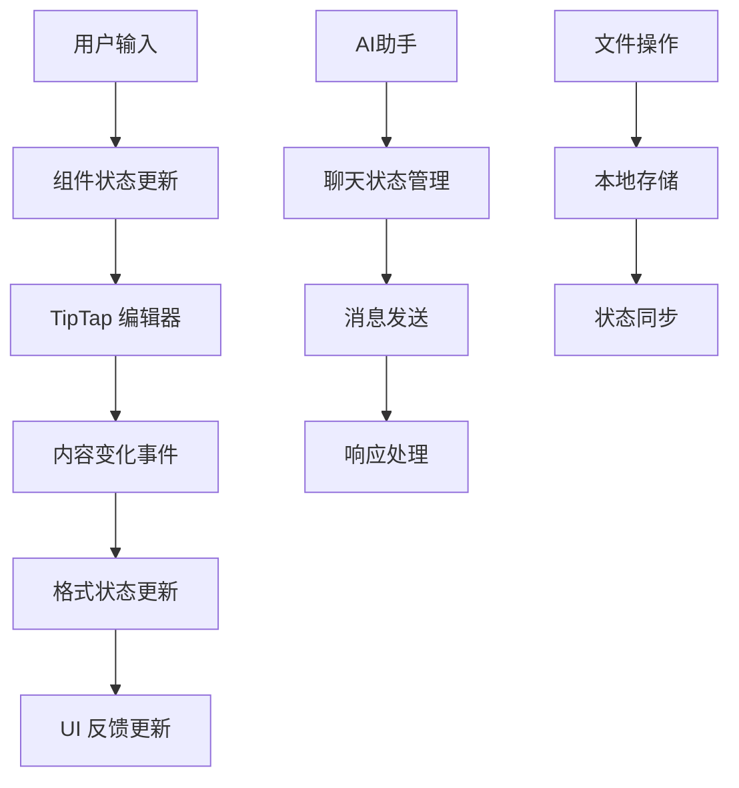

# 格式译专家 - 前端架构文档

## 项目概述

**项目名称**: SeekHub Demo - 格式译专家  
**版本**: 0.1.0  
**描述**: 基于 AI 的智能翻译平台，支持多种文档格式的翻译，保持原文档格式和排版

## 技术栈

### 核心框架
- **Next.js**: 15.2.4 (React 全栈框架，支持 SSR/SSG)
- **React**: ^19 (UI 库)
- **TypeScript**: ^5 (类型安全)

### 样式和UI组件
- **TailwindCSS**: ^3.4.17 (原子化 CSS 框架)
- **Radix UI**: 无障碍性UI组件库
- **Lucide React**: ^0.454.0 (图标库)
- **class-variance-authority**: ^0.7.1 (条件样式)
- **tailwind-merge**: ^2.5.5 (样式合并)
- **tailwindcss-animate**: ^1.0.7 (动画)

### 编辑器和富文本
- **TipTap**: ^3.0.9 (富文本编辑器)
  - @tiptap/react
  - @tiptap/starter-kit
  - @tiptap/extension-* (多种扩展)

### 表单和数据处理
- **React Hook Form**: ^7.54.1 (表单处理)
- **@hookform/resolvers**: ^3.9.1 (表单验证)
- **Zod**: ^3.24.1 (数据验证)

### 其他功能库
- **next-themes**: ^0.4.4 (主题切换)
- **react-resizable-panels**: ^2.1.7 (可调整大小面板)
- **recharts**: 2.15.0 (图表)
- **sonner**: ^1.7.1 (通知)
- **date-fns**: 4.1.0 (日期处理)

## 项目结构

```
seekhub-demo/
├── app/                          # Next.js App Router 页面
│   ├── globals.css              # 全局样式
│   ├── layout.tsx               # 根布局组件
│   ├── loading.tsx              # 全局加载组件
│   ├── page.tsx                 # 首页
│   ├── dashboard/               # 仪表板页面
│   ├── login/                   # 登录页面
│   ├── preview/                 # 预览页面
│   ├── reader-download/         # 读者下载页面
│   ├── reader-translating/      # 读者翻译中页面
│   ├── reader-workspace/        # 读者工作台
│   ├── translate/               # 翻译页面
│   ├── translate-editor/        # 翻译编辑器
│   ├── translating/             # 翻译进行中页面
│   ├── user-type/              # 用户类型选择
│   └── workspace/              # 工作台
├── components/                  # React 组件
│   ├── ui/                     # 基础UI组件 (Radix UI)
│   ├── translate-editor/       # 翻译编辑器组件
│   └── theme-provider.tsx     # 主题提供者
├── context/                    # React Context
├── hooks/                      # 自定义 Hooks
├── lib/                        # 工具函数
├── public/                     # 静态资源
└── styles/                     # 样式文件
```

## 页面架构

### 1. 首页 (`/`)
- **功能**: 平台介绍、功能展示、用户引导
- **组件**: Hero 区域、功能介绍、用户类型选择入口

### 2. 用户类型选择 (`/user-type`)
- **功能**: 区分专业译者和普通读者
- **路由跳转**:
  - 专业译者 → `/workspace`
  - 普通读者 → `/reader-workspace`

### 3. 工作台 (`/workspace`)
- **功能**: 专业译者的主要工作界面
- **特性**: 项目管理、翻译任务、协作功能

### 4. 翻译页面 (`/translate`)
- **功能**: 文档上传、翻译配置、开始翻译

### 5. 翻译进行中 (`/translating`)
- **功能**: 实时显示翻译进度、状态更新

### 6. 翻译编辑器 (`/translate-editor`)
- **功能**: 高级翻译编辑功能
- **核心组件**:
  - EditorCanvas (TipTap 编辑器)
  - FormattingToolbar (格式化工具栏)
  - SideBySideReviewPanel (对照面板)
  - AI 助手聊天界面

### 7. 预览页面 (`/preview`)
- **功能**: 翻译结果预览、质量检查
- **模式**: 
  - 专业译者模式：对照预览、编辑功能
  - 普通读者模式：简单下载

### 8. 读者相关页面
- `/reader-workspace`: 读者工作台
- `/reader-translating`: 读者翻译进度
- `/reader-download`: 读者下载页面

## 核心组件架构

### 翻译编辑器组件系统

#### 1. EditorCanvas
- **文件**: `components/translate-editor/EditorCanvas.tsx`
- **功能**: 基于 TipTap 的富文本编辑器核心
- **特性**:
  - 支持富文本编辑
  - 格式保持
  - 实时内容同步
  - SSR 兼容 (`immediatelyRender: false`)

#### 2. FormattingToolbar
- **文件**: `components/translate-editor/FormattingToolbar.tsx`
- **功能**: 文本格式化工具栏
- **工具**:
  - 文本样式：加粗、斜体、下划线、删除线
  - 颜色：文字颜色、背景高亮
  - 对齐：左对齐、居中、右对齐、两端对齐
  - 列表：项目符号、编号列表
  - 插入：表格、图片、链接

#### 3. SideBySideReviewPanel
- **文件**: `components/translate-editor/SideBySideReviewPanel.tsx`
- **功能**: 原文对照面板
- **特性**:
  - 原文/译文对照
  - 句子级高亮
  - 滚动同步

#### 4. Header
- **文件**: `components/translate-editor/Header.tsx`
- **功能**: 编辑器顶部导航和操作栏
- **特性**:
  - 文档标题编辑
  - 保存状态显示
  - 协作者显示
  - 分享和导出功能

#### 5. MainToolbar
- **文件**: `components/translate-editor/MainToolbar.tsx`
- **功能**: 主工具栏
- **特性**:
  - 文件操作：新建、打开、保存
  - 编辑操作：撤销、重做、查找替换
  - 视图选项：标尺、原文显示

#### 6. StatusBar
- **文件**: `components/translate-editor/StatusBar.tsx`
- **功能**: 底部状态栏
- **信息**:
  - 页码、字数统计
  - 语言显示
  - 视图模式切换
  - 缩放控制

### UI组件系统

基于 **Radix UI** 构建的组件库，包含：

#### 基础组件
- Button, Input, Textarea, Label
- Select, Checkbox, Switch, Toggle
- Card, Badge, Avatar, Separator

#### 布局组件
- Sheet, Dialog, Popover, Tooltip
- Accordion, Collapsible, Tabs
- Sidebar, Breadcrumb, Navigation

#### 数据展示
- Table, Chart, Progress
- Calendar, Carousel, Pagination

#### 反馈组件
- Alert, Toast, Skeleton
- Command, Context Menu, Dropdown Menu

## 状态管理

### React State Management
- **useState**: 组件内部状态
- **useEffect**: 副作用处理
- **useCallback**: 函数缓存
- **useRef**: DOM 引用

### Context API
- **ThemeProvider**: 主题管理
- **FileContext**: 文件上下文 (如果需要)

### 表单状态
- **React Hook Form**: 表单状态管理
- **Zod**: 数据验证

## 样式架构

### TailwindCSS 配置
- **定制主题**: 颜色、字体、间距
- **响应式设计**: 移动端适配
- **动画效果**: 过渡和交互动画
- **暗黑模式**: 主题切换支持

### 组件样式模式
- **CVA (Class Variance Authority)**: 组件变体管理
- **Tailwind Merge**: 样式冲突解决
- **CSS Modules**: 特定样式隔离

## 数据流架构



## 路由架构

### Next.js App Router
- **文件系统路由**: 基于文件夹结构
- **嵌套布局**: 共享布局组件
- **加载状态**: loading.tsx
- **错误处理**: error.tsx (可添加)

### 导航流程
```
首页 → 用户类型选择 → 
├── 专业译者: 工作台 → 翻译 → 编辑器 → 预览
└── 普通读者: 读者工作台 → 翻译进度 → 下载
```

## 性能优化

### Next.js 优化
- **App Router**: 现代化路由系统
- **Server Components**: 服务端渲染
- **Image Optimization**: 图片优化
- **Code Splitting**: 代码分割

### React 优化
- **useMemo/useCallback**: 防止不必要重渲染
- **React.memo**: 组件记忆化
- **Lazy Loading**: 懒加载组件

### TipTap 优化
- **immediatelyRender: false**: SSR 兼容
- **按需加载扩展**: 减少包大小

## 开发工具

### 代码质量
- **TypeScript**: 类型检查
- **ESLint**: 代码规范检查
- **Prettier**: 代码格式化

### 构建工具
- **Next.js**: 构建和打包
- **PostCSS**: CSS 处理
- **Autoprefixer**: 浏览器兼容性

## 部署架构

### 构建命令
```bash
npm run build    # 生产构建
npm run start    # 生产运行
npm run dev      # 开发环境
```

### 环境配置
- **开发环境**: localhost:3000
- **生产环境**: 静态资源 + API 服务器

## 扩展性考虑

### 组件扩展
- **可复用组件**: 基于 Radix UI
- **主题系统**: 支持自定义主题
- **国际化**: 预留多语言支持

### 功能扩展
- **插件系统**: TipTap 扩展架构
- **API 集成**: RESTful/GraphQL 支持
- **实时协作**: WebSocket 集成准备

### 性能扩展
- **CDN**: 静态资源分发
- **缓存策略**: 浏览器和服务器缓存
- **监控系统**: 性能监控和错误追踪

## 维护指南

### 代码规范
- 使用 TypeScript 严格模式
- 遵循 React Hooks 规则
- 组件命名采用 PascalCase
- 文件命名采用 kebab-case

### 版本管理
- 语义化版本控制
- Git Flow 工作流
- 定期依赖更新

### 测试策略
- 单元测试：Jest + React Testing Library
- 集成测试：Cypress/Playwright
- 类型检查：TypeScript

## 总结

这是一个现代化的翻译平台前端架构，具有以下特点：

1. **现代技术栈**: Next.js 15 + React 19 + TypeScript
2. **组件化设计**: 高度可复用的组件系统
3. **用户体验**: 流畅的交互和响应式设计
4. **可扩展性**: 模块化架构支持功能扩展
5. **性能优化**: SSR、代码分割、优化策略
6. **开发体验**: 完整的开发工具链

该架构支持专业译者和普通读者两种用户类型，提供从文档上传到翻译编辑再到预览下载的完整工作流程。